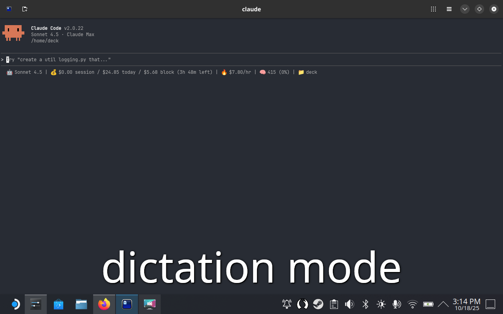

# Dectation

Voice control for Steam Deck using Talon Voice - the perfect blend of "deck" and "dictation"!

Control your Steam Deck hands-free with voice commands using [Talon Voice](https://talonvoice.com/). Toggle between listening and sleeping mode with a simple keyboard shortcut.


*Visual feedback when using "hey claude" - the notification appears while Talon types and submits your message!*

## Features

- 🎤 **Voice Commands**: Full Talon Voice integration for hands-free control
- 🗣️ **"Hey Claude" Wake Word**: Silent listening mode - only responds when you say "hey claude"
- ⌨️ **Hardware Button Toggle**: Press `L1 + Y` on Steam Deck to toggle voice control (`Ctrl+Space`)
- 🎧 **Silent Listening Mode**: Wakes up listening but silent - prevents accidental typing
- 🔄 **Auto-Start**: Automatically starts Talon if not running when triggered
- 🔔 **Visual Feedback**: Desktop notifications show current state (Sleeping 😴 / Listening 🎧)
- 🎮 **Steam Deck Optimized**: Configured specifically for Steam Deck in desktop mode

## Quick Start

**Easy Installation (Recommended):**

```bash
cd ~
git clone https://github.com/joeabbey/dectation.git
cd dectation
./install.sh
```

The installer will automatically:
- Download and install Talon Voice
- Accept the Talon EULA (https://talonvoice.com/EULA.txt)
- Install Talon community commands
- Set up keyboard shortcuts (L1 + Y / Ctrl+Space)
- Configure all scripts

**Note:** By running the installer, you agree to the Talon Voice End User License Agreement.

**After installation:**
1. Speech models need to be installed through Talon's GUI (one-time setup)
2. Right-click Talon tray icon → **Speech Recognition** → **Install Conformer**
3. Press **`L1 + Y`** on your Steam Deck (or `Ctrl+Space`) to toggle voice control!

See the [First Run](#first-run-installing-speech-models) section below for detailed instructions.

### Uninstallation

To remove Dectation from your system:

```bash
cd ~/dectation
./uninstall.sh
```

The uninstaller will:
- Stop Talon if running
- Remove keyboard shortcuts
- Remove desktop file integration
- Remove installed scripts
- Optionally remove Talon Voice and community commands
- Clean up PATH modifications

---

## Manual Installation

If you prefer to install manually or want more control:

### Prerequisites

- Steam Deck in Desktop Mode (KDE Plasma)
- Python 3 (pre-installed on Steam Deck)
- Git and curl (pre-installed on Steam Deck)

### 1. Install Talon Voice

Download and extract Talon for Linux:

```bash
cd ~
curl -L -o talon-linux.tar.xz https://talonvoice.com/dl/latest/talon-linux.tar.xz
tar -xf talon-linux.tar.xz
```

### 2. Accept Talon EULA

On first run, Talon will prompt you to accept the EULA. You can pre-accept it by creating `~/.talon/.sys/app.ini`:

```bash
mkdir -p ~/.talon/.sys
cat > ~/.talon/.sys/app.ini << 'EOF'
[Talon]
IAgreeToEulaVersion=5
EOF
```

Or use the provided script:

```bash
~/dectation/scripts/setup-talon-eula.sh
```

### 3. Install Talon Community Commands

```bash
cd ~/.talon/user
git clone https://github.com/talonhub/community.git
```

### 4. Clone This Repository

```bash
cd ~
git clone https://github.com/joeabbey/dectation.git
```

### 5. Install Scripts

Copy the Talon toggle action:

```bash
cp ~/dectation/talon/toggle_sleep.py ~/.talon/user/
```

Make scripts executable:

```bash
chmod +x ~/dectation/scripts/*.sh
```

### 6. Set Up Keyboard Shortcut

Copy the desktop file:

```bash
cp ~/dectation/toggle-dictation.desktop ~/.local/share/applications/
update-desktop-database ~/.local/share/applications
```

Configure the keyboard shortcut in KDE:

1. Open **System Settings** → **Shortcuts** → **Custom Shortcuts**
2. The shortcut for "toggle-dictation" should appear
3. Set it to `Ctrl+Space` (or your preferred key combination)
4. Click **Apply**

Alternatively, you can manually configure via command line:

```bash
# Add shortcut entry to KDE config
kwriteconfig5 --file kglobalshortcutsrc --group "services" --group "net.local.toggle-dictation.sh.desktop" --key "_launch" "Ctrl+Space"

# Restart the shortcuts service
systemctl --user restart plasma-kglobalaccel.service
```

## First Run: Installing Speech Models

**Important**: On first run, you need to install Talon's speech recognition models through the Talon GUI.

1. Start Talon (it should auto-start after installation, or run `~/dectation/scripts/start-talon.sh`)
2. Look for the Talon microphone icon in your system tray
3. Right-click the icon and select **Speech Recognition** → **Install Conformer**
4. Talon will download the speech models (~100-200MB) in the background
5. You'll receive a notification when models are ready

> **Why manual installation?** Talon requires explicit user consent to download speech models. This step only needs to be done once - models are cached and persist across restarts.

After models are installed, voice recognition will work automatically!

## Usage

### Toggle Voice Control

Press **`L1 + Y`** on your Steam Deck (or `Ctrl+Space` on a keyboard) to toggle between:
- **Listening 🎧** - Talon is awake and listening, but won't type anything until you say "hey claude"
- **Sleeping 😴** - Talon is inactive and ignoring voice input

> **Note**: On Steam Deck hardware, `L1 + Y` is mapped to `Ctrl+Space` in desktop mode
>
> **Tip**: When you wake Talon, it enters silent listening mode. This prevents accidental typing from background conversations while keeping voice control ready!

### Hey Claude - Wake Word for Voice Input

**Workflow:**
1. Press **`L1 + Y`** to wake Talon into listening mode 🎧
2. Talon listens silently - won't type anything you say
3. Say **"hey claude [your message]"** when ready
4. Your message is typed and Enter is pressed automatically!

**Examples:**
- "hey claude create a file called test.py"
- "hey claude what's the weather like today"
- "hey claude search for documentation on React hooks"

**Why this works well:**
- **No accidental typing**: Have conversations freely without triggering dictation
- **Always ready**: Talon stays awake and ready for your "hey claude" command
- **Perfect for chat**: Auto-submit makes it ideal for Claude Code, messaging apps, and searches
- **Hands-free on Steam Deck**: Control everything from your controller

> **Note**: The `hey_claude.talon` file must be installed to `~/.talon/user/` (automatically done by the installer)

### Running Scripts Manually

Start Talon:
```bash
~/dectation/scripts/start-talon.sh
```

Toggle sleep mode:
```bash
~/dectation/scripts/toggle-talon.sh
```

## How It Works

1. **Keyboard Shortcut**: `L1 + Y` (mapped to `Ctrl+Space`) triggers the desktop file via KDE's global shortcuts
2. **Toggle Script**: Checks if Talon is running, starts it if needed
3. **REPL Communication**: Connects to Talon's REPL socket to send commands
4. **Toggle Action**: Calls the custom `toggle_sleep` action in Talon
5. **State Detection**: Checks current mode and toggles between sleep/silent
6. **Silent Mode**: When waking, enables custom silent mode that only responds to "hey claude"
7. **Wake Word**: Saying "hey claude [message]" triggers capture, typing, and auto-submit
8. **Feedback**: Shows desktop notifications for state changes

## File Structure

```
dectation/
├── README.md                    # This file
├── install.sh                   # Easy installer script
├── uninstall.sh                 # Easy uninstaller script
├── dictation-mode-screenshot.png # Screenshot showing visual feedback
├── scripts/
│   ├── start-talon.sh          # Starts Talon in background
│   ├── toggle-talon.sh         # Toggles Talon sleep/wake mode
│   └── setup-talon-eula.sh     # Accepts Talon EULA and configures app.ini
├── talon/
│   ├── toggle_sleep.py         # Talon action for toggling sleep/silent modes
│   ├── silent_mode.py          # Custom silent listening mode definition
│   ├── hey_claude.talon        # "Hey Claude" voice command definition
│   └── hey_claude.py           # Documentation for Hey Claude feature
└── toggle-dictation.desktop    # Desktop file for keyboard shortcut
```

## Troubleshooting

### Voice recognition not working / No speech engine

If Talon starts but doesn't recognize voice commands:

1. **Check if speech models are installed:**
   ```bash
   du -sh ~/.talon/.sys/blob/
   # Should show ~200-250MB if models are installed
   # If only a few KB, models aren't downloaded yet
   ```

2. **Install speech models via Talon GUI:**
   - Right-click Talon tray icon → **Speech Recognition** → **Install Conformer**
   - Wait for download to complete (~100-200MB)
   - You'll see a notification when ready

3. **Verify microphone is detected:**
   - Check Talon logs: `tail ~/.talon/talon.log`
   - Look for "Activating Microphone" messages

### Keyboard shortcut doesn't work

1. Check if the desktop file is installed:
   ```bash
   ls -la ~/.local/share/applications/net.local.toggle-dictation.sh.desktop
   ```

2. Verify the shortcut is registered:
   ```bash
   grep "toggle-dictation" ~/.config/kglobalshortcutsrc
   ```

3. Restart the shortcuts service:
   ```bash
   systemctl --user restart plasma-kglobalaccel.service
   ```

### Talon doesn't start

1. Check if Talon is installed:
   ```bash
   ls -la ~/talon/talon
   ```

2. Try starting Talon manually:
   ```bash
   ~/dectation/scripts/start-talon.sh
   ```

3. Check Talon logs:
   ```bash
   tail -f ~/.talon/talon.log
   ```

### Toggle doesn't work but Talon is running

1. Check if `toggle_sleep.py` is installed:
   ```bash
   ls -la ~/.talon/user/toggle_sleep.py
   ```

2. Check Talon's REPL socket:
   ```bash
   ls -la ~/.talon/.sys/repl.sock
   ```

3. Test the toggle manually:
   ```bash
   ~/dectation/scripts/toggle-talon.sh
   ```

### Enable Debug Logging

Uncomment debug lines in `scripts/toggle-talon.sh` to enable detailed logging:

```bash
# Change this line:
# echo "=== $(date '+%Y-%m-%d %H:%M:%S') ===" >> "$DEBUG_LOG"

# To this:
echo "=== $(date '+%Y-%m-%d %H:%M:%S') ===" >> "$DEBUG_LOG"
```

Then check logs at:
- `~/.talon/toggle-debug.log` - Script debug output
- `~/.talon/toggle.log` - Toggle events
- `~/.talon/talon.log` - Talon application log

## Credits

- [Talon Voice](https://talonvoice.com/) by Ryan Hileman
- [Talon Community](https://github.com/talonhub/community) for community commands
- Developed for Steam Deck enthusiasts wanting hands-free control

## License

MIT License - Feel free to use and modify!

## Contributing

Contributions welcome! Please open an issue or pull request.

## Support

Having issues? Please check the Troubleshooting section above or open an issue on GitHub.
